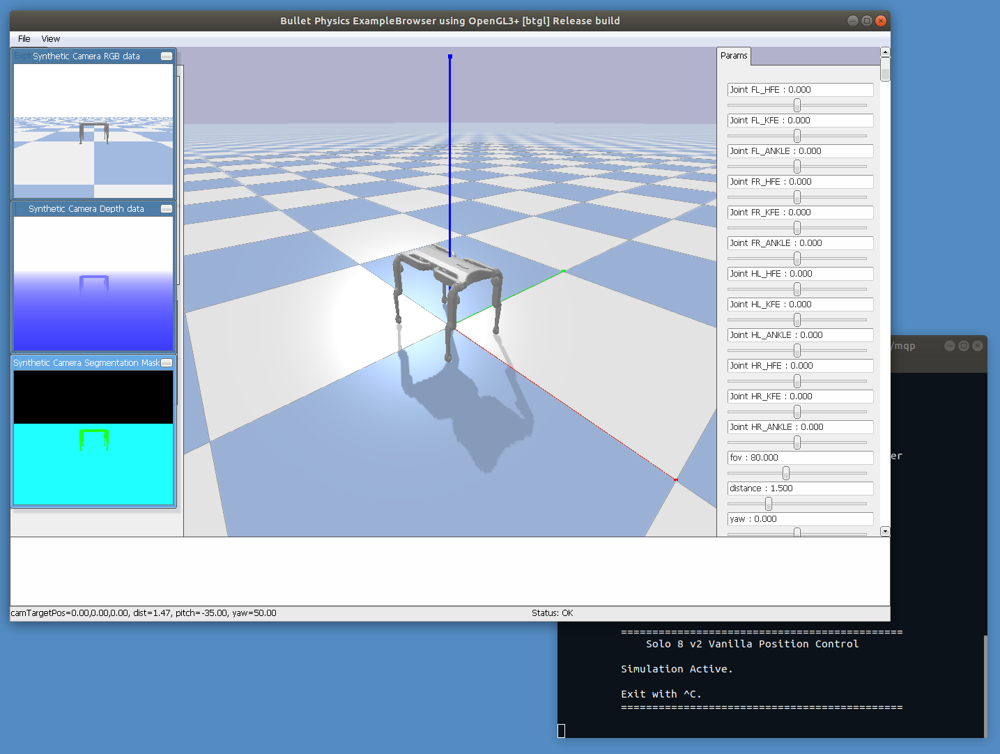

<h1 align='center'> 
  Solo Gym 
    
  
  
</h1>

<i>A custom open ai gym environment for Solo experimentation.
  </i>

---

# Installation
The recommended way to set up this environment is to use virtualenv's for its
sandboxing. With that:

1. Clone and navigate to this repository from your terminal
2. `python -m venv venv-gym-solo`
3. `source venv-gym-solo/bin/activate`
4. `pip install --upgrade wheel pip`
5. `pip install -e .`

And the package should be installed! Note that this is in development mode
so any local changes will be reflected in the package as well.

# Running Tests
All of our tests can be run by using python's built in `unittest`. However,due to how PyBullet works, we require some extra dependencies. To run the
tests, use the following procedure:

1. Install `xvfb` (on Ubuntu, you can do `sudo apt install xvfb`)
2. Follow the instructions above for creating the virtual environment,
   but use `pip install -e .[test]` instead of `pip install -e .`
4. Navigate to the root of the repository
5. `python -m unittest discover -v .`